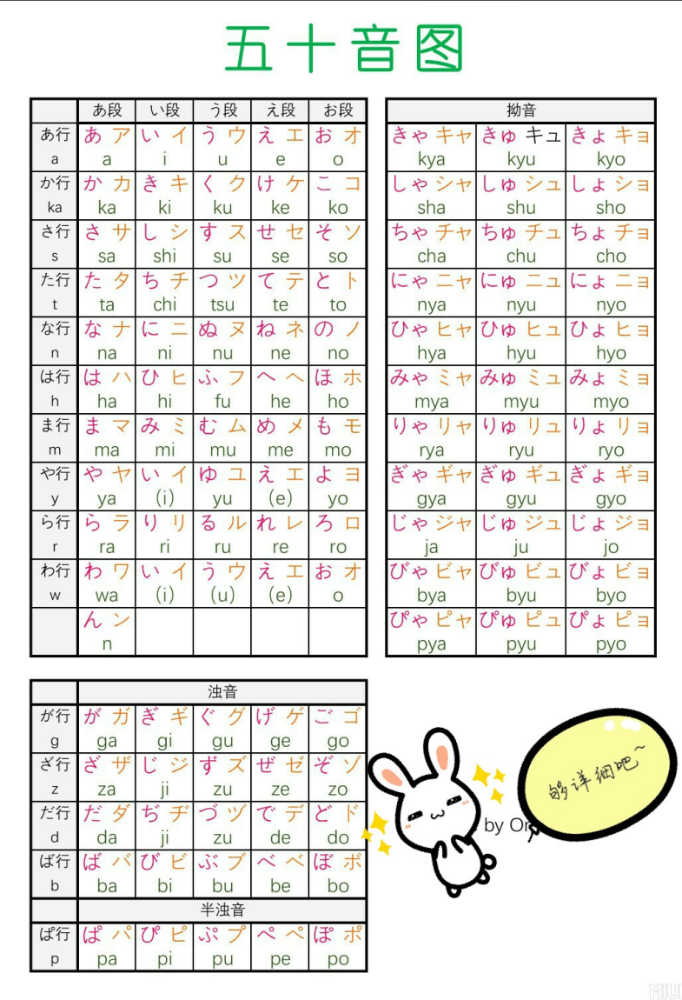

## 0、五十音图

## 1、动词分类

日语动词分为三类，每一类动词有不同的变形规则。了解动词的分类非常重要，因为这将影响你如何进行动词变形。

### 1）一类动词（五段动词）

- 特点：一类动词的基本形通常以「う、つ、る、む、ぶ、ぬ、く、ぐ、す」结尾。
- 变形：这些动词的变化会依照五段的规则进行。例如，动词「書く」（写）根据不同的语法形式会发生不同的变形。
  - ます形：書きます（写）
  - て形：書いて（写的）
  - た形：書いた（写了）
  - ない形：書かない（不写）

### 2）二类动词（一段动词）

- 特点：二类动词以「る」结尾，并且在「る」之前的音节是一个「い段」或「え段」的音。
- 变形：二类动词的变化比较规则，通常直接去掉「る」加上不同的后缀即可。例如，动词「食べる」（吃）：
  - ます形：食べます（吃）
  - て形：食べて（吃的）
  - た形：食べた（吃了）
  - ない形：食べない（不吃）

### 3）三类动词（不规则动词）

- 特点：三类动词有两个不规则的动词，分别是「する」和「来る」。
- 变形：这两个动词的变形不遵循一类或二类动词的规则。
  - する（做）：
    - ます形：します（做）
    - て形：して（做的）
    - た形：した（做了）
    - ない形：しない（不做）
  - 来る（来）：
    - ます形：来ます（来）
    - て形：来て（来的）
    - た形：来た（来了）
    - ない形：来ない（不来）

## 2、动词变形

------

### 1）**辞书形（基本形）**

这是动词的原形，通常用于辞典中。比如「食べる」（吃）「行く」（去）等。

**变形规则：**

- 直接是动词的原形，用于表示现在时、一般状态、或引用。
  - 例如：食べる（吃）、行く（去）

------

### 2） **ます形（敬语形）**

这是在正式场合或对长辈、上司使用时的形式，表示礼貌。

**变形规则：**

- **五段动词：**结尾变为「い」段 + ます。
  - 例如：行く（去）→ 行きます（去）
- **一段动词：**去掉「る」，加上「ます」。
  - 例如：食べる（吃）→ 食べます（吃）
- **不规则动词：**变化为「します」和「来ます」。
  - 例如：する（做）→ します（做）、来る（来）→ 来ます（来）

------

### 3） **て形**

て形是动词的一个非常重要的变形，用于连接句子、表示请求、命令或表达状态等。

**变形规则：**

- **五段动词：**根据结尾音变化，去掉原动词末尾，添加「て」或「で」。
  - 例如：行く（去）→ 行って（去的）、書く（写）→ 書いて（写的）
- **一段动词：**去掉「る」，加上「て」。
  - 例如：食べる（吃）→ 食べて（吃的）、見る（看）→ 見て（看的）
- **不规则动词：**
  - する→ して
  - 来る→ 来て

------

### 4） **た形（过去形）**

た形表示过去发生的动作或状态。

**变形规则：**

- **五段动词：**根据结尾音变化，去掉原动词末尾，添加「た」或「だ」。
  - 例如：行った（去了）、書いた（写了）
- **一段动词：**去掉「る」，加上「た」。
  - 例如：食べた（吃了）、見た（看了）
- **不规则动词：**
  - する→ した
  - 来る→ 来た

------

### 5） **ない形（否定形）**

这个形态表示动词的否定，通常用于口语中表示“不做”。

**变形规则：**

- **五段动词：**将结尾音改为「あ段」，并加上「ない」。
  - 例如：行かない（不去）、書かない（不写）
- **一段动词：**去掉「る」，加上「ない」。
  - 例如：食べない（不吃）、見ない（不看）
- **不规则动词：**
  - する→ しない
  - 来る→ 来ない

------

### 6） **意向形**

意向形表示说话者的意图或提议，常用于表示“想做某事”或“让我们做某事”。

**变形规则：**

- **五段动词：**去掉「う、つ、る」等结尾，改为「お」段 + 「う」的形式。
  - 例如：行こう（我们去吧）、書こう（我们写吧）
- **一段动词：**去掉「る」，加上「よう」。
  - 例如：食べよう（我们吃吧）、見よう（我们看吧）
- **不规则动词：**
  - する→ しよう
  - 来る→ 来よう

------

### 7） **可能形**

可能形表示能力或可能性，表示“能够做某事”。

**变形规则：**

- **五段动词：**将结尾音变为「ける」，其他音变化为「られる」形式。
  - 例如：行ける（能去）、書ける（能写）
- **一段动词：**去掉「る」，加上「られる」。
  - 例如：食べられる（能吃）、見られる（能看）
- **不规则动词：**
  - する→ できる
  - 来る→ 来られる

------

### 8） **命令形**

命令形用来给出命令或请求。

**变形规则：**

- **五段动词：**去掉原形的「う、つ、る」等结尾，改为「え」段。
  - 例如：行け（去吧）、書け（写吧）
- **一段动词：**去掉「る」，直接加「ろ」。
  - 例如：食べろ（吃吧）、見ろ（看吧）
- **不规则动词：**
  - する→ しろ
  - 来る→ 来い

------

### 9） **条件形（ば形）**

条件形用来表示假设、条件，通常以「れば」结尾。

**变形规则：**

- **五段动词：**去掉结尾音「う」，变え段 + 「ば」。
  - 例如：行けば（如果去）、書けば（如果写）
- **一段动词：**去掉「る」，加上「れば」。
  - 例如：食べれば（如果吃）、見れば（如果看）
- **不规则动词：**
  - する→ すれば
  - 来る→ 来れば

------

### 10） **たら形**

たら形也是表示假设条件的语法，常用在口语中。

**变形规则：**

- **五段动词：**去掉结尾音，改为「たら」。
  - 例如：行ったら（去了的话）、書いたら（写了的话）
- **一段动词：**去掉「る」，加上「たら」。
  - 例如：食べたら（吃了的话）、見たら（看了的话）
- **不规则动词：**
  - する→ したら
  - 来る→ 来たら

------

### 11） **使役形**

使役形表示“让某人做某事”，例如使役动词的“让”或“使”。

**变形规则：**

- **五段动词**：去掉结尾音，改为「せる」或「させる」。
  - 例如：行かせる（让某人去）、書かせる（让某人写）
- **一段动词：**去掉「る」，加上「させる」。
  - 例如：食べさせる（让某人吃）、見させる（让某人看）
- **不规则动词：**
  - する→ させる
  - 来る→ 来させる

## 3、常用动词

### 3.1、家庭常用动词

#### 1）食べる

- **类型**：一段动词（る动词），**自动词**
- **意味**：食べる（たべる）——吃，进食，指将食物放入口中并咀嚼吞咽。

**固定搭配短语**：

- **食べ物（たべもの）**：食物
- **食べ過ぎる（たべすぎる）**：吃得过多，暴饮暴食
- **食べたい（たべたい）**：想吃（表示愿望）

------

#### 2）見る

- **类型**：一段动词（る动词），**他动词**
- **意味**：見る（みる）——看，观察，注视。

**固定搭配短语**：

- **見るべき（みるべき）**：应该看的
- **見ると（みると）**：一看就……
- **見える（みえる）**：能看见，看到

------

#### 3）使う

- **类型**：五段动词（う动词），**他动词**
- **意味**：使う（つかう）——使用，运用，利用。

**固定搭配短语**：

- **使い方（つかいかた）**：使用方法
- **使い過ぎ（つかいすぎ）**：使用过度
- **使える（つかえる）**：能用，能够使用

------

#### 4）掃除する

- **类型**：サ変动词（する动词），**他动词**
- **意味**：掃除する（そうじする）——打扫，清洁。

**固定搭配短语**：

- **掃除機（そうじき）**：吸尘器
- **掃除用具（そうじようぐ）**：清洁工具
- **掃除をする（そうじをする）**：打扫卫生

------

#### 5）洗う

- **类型**：五段动词（う动词），**他动词**
- **意味**：洗う（あらう）——洗涤，清洗。

**固定搭配短语**：

- **洗濯（せんたく）**：洗衣
- **洗い物（あらいもの）**：洗碗，洗东西
- **洗える（あらえる）**：能洗，能清洗

------

#### 6）作る

- **类型**：五段动词（う动词），**他动词**
- **意味**：作る（つくる）——做，制造，制作。

**固定搭配短语**：

- **料理を作る（りょうりをつくる）**：做饭
- **作り方（つくりかた）**：制作方法
- **作れる（つくれる）**：能做，能够制作

------

#### 7）寝る

- **类型**：一段动词（る动词），**自动词**
- **意味**：寝る（ねる）——睡觉，躺下。

**固定搭配短语**：

- **寝室（しんしつ）**：卧室
- **寝不足（ねぶそく）**：睡眠不足
- **寝かせる（ねかせる）**：让某人睡觉

------

#### 8）起きる

- **类型**：一段动词（る动词），**自动词**
- **意味**：起きる（おきる）——起床，醒来，起立。

**固定搭配短语**：

- **早起き（はやおき）**：早起
- **起き上がる（おきあがる）**：站起来，起身
- **起きている（おきている）**：醒着，没睡觉

------

#### 9）買う

- **类型**：五段动词（う动词），**他动词**
- **意味**：買う（かう）——购买，买。

**固定搭配短语**：

- **買い物（かいもの）**：购物
- **買い物袋（かいものぶくろ）**：购物袋
- **買い替える（かいかえる）**：更换购买

------

#### 10）運ぶ

- **类型**：五段动词（う动词），**他动词**
- **意味**：運ぶ（はこぶ）——搬运，运送。

**固定搭配短语**：

- **運搬（うんぱん）**：搬运，运输
- **運転（うんてん）**：驾驶，开车
- **運び入れる（はこびいれる）**：搬进

------

#### 11）借りる

- **类型**：一段动词（る动词），**他动词**
- **意味**：借（别人东西），租借。

**固定搭配短语**：

- **借り物（かりもの）**：借来的东西
- **借りること（かりること）**：借用
- **借り手（かりて）**：借用者

------

#### 12）返す

- **类型**：五段动词（う动词），**他动词**
- **意味**：返す（かえす）——归还，回报。

**固定搭配短语**：

- **返却（へんきゃく）**：归还
- **返すこと（かえすこと）**：归还的事
- **返して（かえして）**：归还，返还（命令形）

------

#### 13）料理する

- **类型**：サ変动词（する动词），**他动词**
- **意味**：料理する（りょうりする）——做饭，烹饪。

**固定搭配短语**：

- **料理法（りょうりほう）**：做菜的方法
- **家庭料理（かていりょうり）**：家常菜
- **料理教室（りょうりきょうしつ）**：烹饪教室

------

#### 14）歩く

- **类型**：五段动词（う动词），**自动词**
- **意味**：歩く（あるく）——走，步行。

**固定搭配短语**：

- **散歩（さんぽ）**：散步
- **歩道（ほどう）**：人行道
- **歩き方（あるきかた）**：走路方法

------

#### 15）話す

- **类型**：五段动词（う动词），**他动词**
- **意味**：話す（はなす）——说话，谈论。

**固定搭配短语**：

- **話題（わだい）**：话题
- **話し方（はなしかた）**：说话方式
- **話をする（はなしをする）**：谈话，交谈

------

#### 16）書く

- **类型**：五段动词（う动词），**他动词**
- **意味**：書く（かく）——写，书写。

**固定搭配短语**：

- **手紙を書く（てがみをかく）**：写信
- **書き方（かきかた）**：写法
- **書き上げる（かきあげる）**：写完

------

#### 17）洗濯する

- **类型**：サ変动词（する动词），**他动词**
- **意味**：洗濯する（せんたくする）——洗衣，清洗衣物。

**固定搭配短语**：

- **洗濯物（せんたくもの）**：洗衣物
- **洗濯機（せんたくき）**：洗衣机
- **洗濯をする（せんたくをする）**：做洗衣

------

#### 18）運転する

- **类型**：サ変动词（する动词），**他动词**
- **意味**：運転する（うんてんする）——驾驶，操控（交通工具）。

**固定搭配短语**：

- **運転免許（うんてんめんきょ）**：驾驶执照
- **運転手（うんてんしゅ）**：司机
- **運転中（うんてんちゅう）**：驾驶中

------

#### 19）探す

- **类型**：五段动词（う动词），**他动词**
- **意味**：探す（さがす）——寻找，搜寻。

**固定搭配短语**：

- **探し物（さがしもの）**：丢失物品
- **探し出す（さがしだす）**：找出
- **探している（さがしている）**：正在寻找

------

#### 20）送る

- **类型**：五段动词（う动词），**他动词**
- **意味**：送る（おくる）——送，寄送，传送。

**固定搭配短语**：

- **送信（そうしん）**：发送
- **送迎（そうげい）**：接送
- **送り物（おくりもの）**：礼物

------

#### 21）借りる

- **类型**：一段动词（る动词），**他动词**
- **意味**：借，借用。

**固定搭配短语**：

- **借り物（かりもの）**：借来的物品
- **貸し借り（かしかり）**：借与贷
- **借りること（かりること）**：借用的事

------

#### 22）返す

- **类型**：五段动词（う动词），**他动词**
- **意味**：返す（かえす）——归还，返还。

**固定搭配短语**：

- **返却（へんきゃく）**：归还
- **返し（かえし）**：归还的东西
- **返す時（かえすとき）**：归还时

------

#### 23）遊ぶ

- **类型**：五段动词（う动词），**自动词**
- **意味**：遊ぶ（あそぶ）——玩，娱乐，休闲。

**固定搭配短语**：

- **遊園地（ゆうえんち）**：游乐园
- **遊び場（あそびば）**：娱乐场所
- **遊びに行く（あそびにいく）**：去玩

------

#### 24）掃除する

- **类型**：サ変动词（する动词），**他动词**
- **意味**：掃除する（そうじする）——打扫，清理。

**固定搭配短语**：

- **掃除機（そうじき）**：吸尘器
- **掃除道具（そうじどうぐ）**：清洁工具
- **掃除をする（そうじをする）**：进行清扫

------

#### 25）切る

- **类型**：五段动词（う动词），**他动词**
- **意味**：切る（きる）——切，割。

**固定搭配短语**：

- **切り方（きりかた）**：切的方法
- **切り分ける（きりわける）**：切开
- **切れる（きれる）**：能切，锋利

------

#### 26）起こす

- **类型**：五段动词（う动词），**他动词**
- **意味**：起こす（おこす）——叫醒，唤起，导致。

**固定搭配短语**：

- **起こし方（おこしかた）**：叫醒的方法
- **起こし時間（おこしじかん）**：起床时间
- **事故を起こす（じこをおこす）**：发生事故

------

#### 27）教える

- **类型**：一段动词（る动词），**他动词**
- **意味**：教える（おしえる）——教，告知。

**固定搭配短语**：

- **教科書（きょうかしょ）**：教科书
- **教え方（おしえかた）**：教的方式
- **教えること（おしえること）**：教的事

------

#### 28）学ぶ

- **类型**：五段动词（う动词），**他动词**
- **意味**：学ぶ（まなぶ）——学习，研究。

**固定搭配短语**：

- **学ぶべき（まなぶべき）**：应该学习
- **学び方（まなびかた）**：学习方法
- **学んでいる（まなんでいる）**：正在学习

------

#### 29）待つ

- **类型**：五段动词（う动词），**他动词**
- **意味**：待つ（まつ）——等，等待。

**固定搭配短语**：

- **待ち合わせ（まちあわせ）**：约会，集合
- **待つこと（まつこと）**：等待的事
- **待っている（まっている）**：在等待

------

#### 30）寝かせる

- **类型**：一段动词（る动词），**他动词**
- **意味**：寝かせる（ねかせる）——让某人入睡，哄睡。

**固定搭配短语**：

- **寝かせ方（ねかせかた）**：哄睡的方法
- **寝かしつける（ねかしつける）**：哄某人睡觉
- **寝かせる時間（ねかせるじかん）**：让某人入睡的时间

------

#### 31）起きる

- **类型**：一段动词（る动词），**自动词**
- **意味**：起きる（おきる）——起床，醒来，发生。

**固定搭配短语**：

- **起きる時間（おきるじかん）**：起床时间
- **早起き（はやおき）**：早起
- **起きている（おきている）**：正在醒着

------

#### 32）出す

- **类型**：五段动词（う动词），**他动词**
- **意味**：出す（だす）——拿出，取出，交给。

**固定搭配短语**：

- **ゴミを出す（ごみをだす）**：倒垃圾
- **郵便を出す（ゆうびんをだす）**：寄信
- **出す時間（だすじかん）**：拿出的时间

------

#### 33）使う

- **类型**：五段动词（う动词），**他动词**
- **意味**：使う（つかう）——使用，运用。

**固定搭配短语**：

- **使い方（つかいかた）**：使用方法
- **使える（つかえる）**：能使用
- **使い過ぎ（つかいすぎ）**：使用过度

------

#### 34）聞く

- **类型**：五段动词（う动词），**他动词**
- **意味**：聞く（きく）——听，问。

**固定搭配短语**：

- **質問を聞く（しつもんをきく）**：询问问题
- **音楽を聞く（おんがくをきく）**：听音乐
- **聞き取り（ききとり）**：听力

------

#### 35）着る

- **类型**：一段动词（る动词），**他动词**
- **意味**：着る（きる）——穿，穿戴。

**固定搭配短语**：

- **服を着る（ふくをきる）**：穿衣服
- **着替える（きがえる）**：换衣服
- **着るもの（きるもの）**：穿的东西

------

#### 36）走る

- **类型**：五段动词（う动词），**自动词**
- **意味**：走る（はしる）——跑，跑步。

**固定搭配短语**：

- **走り方（はしりかた）**：跑步方法
- **走る速度（はしるそくど）**：跑步速度
- **速く走る（はやくはしる）**：跑得快

------

#### 37）歩く

- **类型**：五段动词（う动词），**自动词**
- **意味**：歩く（あるく）——走，步行。

**固定搭配短语**：

- **歩き方（あるきかた）**：走路方法
- **歩道（ほどう）**：人行道
- **早歩き（はやあるき）**：快走

------

#### 38）話す

- **类型**：五段动词（う动词），**他动词**
- **意味**：話す（はなす）——说，讲话，谈话。

**固定搭配短语**：

- **話をする（はなしをする）**：谈话
- **話し方（はなしかた）**：说话方式
- **話題（わだい）**：话题

------

#### 39）取る

- **类型**：五段动词（う动词），**他动词**
- **意味**：取る（とる）——取，拿，获取。

**固定搭配短语**：

- **写真を取る（しゃしんをとる）**：拍照
- **取引（とりひき）**：交易，生意
- **取らない（とらない）**：不拿

------

#### 40）使い捨て

- **类型**：一段动词（る动词），**他动词**
- **意味**：使い捨て（つかいすて）——一次性使用。

**固定搭配短语**：

- **使い捨てカメラ（つかいすてカメラ）**：一次性相机
- **使い捨て食器（つかいすてしょっき）**：一次性餐具
- **使い捨てマスク（つかいすてマスク）**：一次性口罩

------

#### 41）食べさせる

- **类型**：一段动词（る动词），**他动词**
- **意味**：食べさせる（たべさせる）——让某人吃，喂。

**固定搭配短语**：

- **子供に食べさせる（こどもにたべさせる）**：喂孩子吃
- **食べさせられる（たべさせられる）**：被迫吃

------

#### 42）片付ける

- **类型**：一段动词（る动词），**他动词**
- **意味**：片付ける（かたづける）——整理，收拾。

**固定搭配短语**：

- **部屋を片付ける（へやをかたづける）**：整理房间
- **片付け方（かたづけかた）**：整理方法
- **片付けること（かたづけること）**：收拾的事

------

#### 43）選ぶ

- **类型**：五段动词（う动词），**他动词**
- **意味**：選ぶ（えらぶ）——选择，挑选。

**固定搭配短语**：

- **選び方（えらびかた）**：选择方式
- **選択肢（せんたくし）**：选择项
- **選ばれる（えらばれる）**：被选中

------

#### 44）結婚する

- **类型**：サ変动词（する动词），**他动词**
- **意味**：結婚する（けっこんする）——结婚。

**固定搭配短语**：

- **結婚式（けっこんしき）**：婚礼
- **結婚相手（けっこんあいて）**：结婚对象
- **結婚生活（けっこんせいかつ）**：婚姻生活

------

#### 45）助ける

- **类型**：一段动词（る动词），**他动词**
- **意味**：助ける（たすける）——帮助，援助。

**固定搭配短语**：

- **助け合う（たすけあう）**：互相帮助
- **助け手（たすけて）**：帮手
- **助けを求める（たすけをもとめる）**：寻求帮助

------

#### 46）守る

- **类型**：五段动词（う动词），**他动词**
- **意味**：守る（まもる）——守护，保护，遵守。

**固定搭配短语**：

- **守るべき（まもるべき）**：应该遵守
- **守っている（まもっている）**：正在保护
- **守ること（まもること）**：保护的事

------

#### 47）怒る

- **类型**：五段动词（う动词），**自动词**
- **意味**：怒る（おこる）——生气，发怒。

**固定搭配短语**：

- **怒らせる（おこらせる）**：惹怒
- **怒り（いかり）**：愤怒
- **怒っている（おこっている）**：在生气

------

#### 48）答える

- **类型**：一段动词（る动词），**他动词**
- **意味**：答える（こたえる）——回答，答复。

**固定搭配短语**：

- **答え（こたえ）**：答案
- **答えを出す（こたえをだす）**：给出答案
- **答え方（こたえかた）**：回答的方式

------

#### 49）泣く

- **类型**：五段动词（う动词），**自动词**
- **意味**：泣く（なく）——哭，流泪。

**固定搭配短语**：

- **泣き声（なきごえ）**：哭声
- **泣き止む（なきやむ）**：停止哭泣
- **泣いている（ないている）**：正在哭

------

#### 50）笑う

- **类型**：五段动词（う动词），**自动词**
- **意味**：笑う（わらう）——笑，微笑。

**固定搭配短语**：

- **笑顔（えがお）**：笑脸
- **笑い声（わらいごえ）**：笑声
- **笑っている（わらっている）**：正在笑

### 3.2、IT行业常用动词

#### 1）開発する

- **类型**：サ変动词（する动词），**他动词**
- **意味**：開発する（かいはつする）——开发，开拓，指创建新产品、系统或应用的过程。

**固定搭配短语**：

- **ソフトウェア開発（ソフトウェアかいはつ）**：软件开发
- **アプリケーション開発（アプリケーションかいはつ）**：应用程序开发
- **システム開発（システムかいはつ）**：系统开发

------

#### 2）実装する

- **类型**：サ変动词（する动词），**他动词**
- **意味**：実装する（じっそうする）——实现，指将计划或设计的功能、模块、系统等具体实现出来。

**固定搭配短语**：

- **機能実装（きのうじっそう）**：功能实现
- **API実装（APIじっそう）**：API实现
- **コード実装（コードじっそう）**：代码实现

------

#### 3）テストする

- **类型**：サ変动词（する动词），**他动词**
- **意味**：テストする（テストする）——测试，指对软件或系统进行功能、性能、稳定性等方面的检查。

**固定搭配短语**：

- **単体テスト（たんたいてすと）**：单元测试
- **統合テスト（とうごうてすと）**：集成测试
- **テストケース（テストケース）**：测试用例

------

#### 4）デバッグする

- **类型**：サ変动词（する动词），**他动词**
- **意味**：デバッグする——调试，修复程序中的错误。

**固定搭配短语**：

- **バグをデバッグする（バグをデバッグする）**：调试BUG
- **デバッグツール（デバッグツール）**：调试工具
- **デバッグ作業（デバッグさぎょう）**：调试工作

------

#### 5）更新する

- **类型**：サ変动词（する动词），**他动词**
- **意味**：更新する（こうしんする）——更新，指软件、系统或应用的版本、内容等的修改与更新。

**固定搭配短语**：

- **ソフトウェア更新（ソフトウェアこうしん）**：软件更新
- **アップデートを更新する（アップデートをこうしんする）**：更新更新（类似软件升级）
- **データベース更新（データベースこうしん）**：数据库更新

------

#### 6）設計する

- **类型**：サ変动词（する动词），**他动词**
- **意味**：設計する（せっけいする）——设计，指系统、应用或软件的架构设计、功能设计等。

**固定搭配短语**：

- **システム設計（システムせっけい）**：系统设计
- **UI設計（UIせっけい）**：UI设计
- **データベース設計（データベースせっけい）**：数据库设计

------

#### 7）接続する

- **类型**：五段动词（う动词），**他动词**
- **意味**：接続する（せつぞくする）——连接，指连接系统、网络、数据库等。

**固定搭配短语**：

- **ネットワーク接続（ネットワークせつぞく）**：网络连接
- **API接続（APIせつぞく）**：API连接
- **データベース接続（データベースせつぞく）**：数据库连接

------

#### 8）実行する

- **类型**：サ変动词（する动词），**他动词**
- **意味**：実行する（じっこうする）——执行，指运行程序、任务等。

**固定搭配短语**：

- **プログラムを実行する（プログラムをじっこうする）**：执行程序
- **テストケース実行（テストケースじっこう）**：执行测试用例
- **コマンド実行（コマンドじっこう）**：执行命令

------

#### 9）統合する

- **类型**：サ変动词（する动词），**他动词**
- **意味**：統合する（とうごうする）——集成，指将不同模块或系统整合成一个完整的系统。

**固定搭配短语**：

- **システム統合（システムとうごう）**：系统集成
- **データ統合（データとうごう）**：数据集成
- **ツール統合（ツールとうごう）**：工具集成

------

#### 10）保存する

- **类型**：サ変动词（する动词），**他动词**
- **意味**：保存する（ほぞんする）——保存，指将数据、文件等保存到系统中。

**固定搭配短语**：

- **データ保存（データほぞん）**：数据保存
- **バックアップ保存（バックアップほぞん）**：备份保存
- **保存先（ほぞんさき）**：保存位置

------

#### 11）管理する

- **类型**：サ変动词（する动词），**他动词**
- **意味**：管理する（かんりする）——管理，指对项目、系统、数据或资源进行监督和控制。

**固定搭配短语**：

- **プロジェクト管理（プロジェクトかんり）**：项目管理
- **ユーザー管理（ユーザーかんり）**：用户管理
- **システム管理（システムかんり）**：系统管理

------

#### 12）同期する

- **类型**：サ変动词（する动词），**他动词**
- **意味**：同期する（どうきする）——同步，指不同的系统、数据或设备在时间上或状态上一致。

**固定搭配短语**：

- **データ同期（データどうき）**：数据同步
- **ファイル同期（ファイルどうき）**：文件同步
- **リアルタイム同期（リアルタイムどうき）**：实时同步

------

#### 13）修正する

- **类型**：サ変动词（する动词），**他动词**
- **意味**：修正する（しゅうせいする）——修正，指对代码、数据、功能等进行修改以修复错误或改进。

**固定搭配短语**：

- **バグ修正（バグしゅうせい）**：BUG修复
- **コード修正（コードしゅうせい）**：代码修正
- **データ修正（データしゅうせい）**：数据修正

------

#### 14）作成する

- **类型**：サ変动词（する动词），**他动词**
- **意味**：作成する（さくせいする）——创建，指从头开始创建某个对象或文档等。

**固定搭配短语**：

- **レポート作成（レポートさくせい）**：报告创建
- **ドキュメント作成（ドキュメントさくせい）**：文档创建
- **プラン作成（プランさくせい）**：计划创建

------

#### 15）アップデートする

- **类型**：サ変动词（する动词），**他动词**
- **意味**：アップデートする——更新，指对软件或系统进行版本更新或内容升级。

**固定搭配短语**：

- **アプリアップデート（アプリアップデート）**：应用更新
- **システムアップデート（システムアップデート）**：系统更新
- **セキュリティアップデート（セキュリティアップデート）**：安全性更新

------

#### 16）接続する

- **类型**：五段动词（う动词），**他动词**
- **意味**：接続する（せつぞくする）——连接，指将设备、系统或网络连接起来。

**固定搭配短语**：

- **データ接続（データせつぞく）**：数据连接
- **VPN接続（VPNせつぞく）**：VPN连接
- **サーバ接続（サーバせつぞく）**：服务器连接

------

#### 17）開始する

- **类型**：サ変动词（する动词），**他动词**
- **意味**：開始する（かいしする）——开始，指启动某个任务、进程或项目。

**固定搭配短语**：

- **プロジェクト開始（プロジェクトかいし）**：项目开始
- **システム開始（システムかいし）**：系统启动
- **サービス開始（サービスかいし）**：服务开始

------

#### 18）停止する

- **类型**：サ変动词（する动词），**他动词**
- **意味**：停止する（ていしする）——停止，指中止某个进程、任务或服务。

**固定搭配短语**：

- **サービス停止（サービスていし）**：服务停止
- **プロセス停止（プロセスていし）**：进程停止
- **バックアップ停止（バックアップていし）**：备份停止

------

#### 19）削除する

- **类型**：サ変动词（する动词），**他动词**
- **意味**：削除する（さくじょする）——删除，指将数据、文件、记录等删除。

**固定搭配短语**：

- **データ削除（データさくじょ）**：数据删除
- **ファイル削除（ファイルさくじょ）**：文件删除
- **ユーザー削除（ユーザーさくじょ）**：用户删除

------

#### 20）開放する

- **类型**：サ変动词（する动词），**他动词**
- **意味**：開放する（かいほうする）——开放，指开放某些功能、端口、接口等。

**固定搭配短语**：

- **API開放（APIかいほう）**：API开放
- **アクセス開放（アクセスかいほう）**：访问开放
- **ポート開放（ポートかいほう）**：端口开放

------

#### 21）同期する

- **类型**：サ変动词（する动词），**他动词**
- **意味**：同期する（どうきする）——同步，指对多个数据源或系统的同步处理。

**固定搭配短语**：

- **データ同期（データどうき）**：数据同步
- **システム同期（システムどうき）**：系统同步
- **ファイル同期（ファイルどうき）**：文件同步

------

#### 22）利用する

- **类型**：サ変动词（する动词），**他动词**
- **意味**：利用する（りようする）——利用，指将某种资源或工具用于某个目的。

**固定搭配短语**：

- **API利用（APIりよう）**：API利用
- **クラウド利用（クラウドりよう）**：云计算利用
- **リソース利用（リソースりよう）**：资源利用

------

#### 23）監視する

- **类型**：サ変动词（する动词），**他动词**
- **意味**：監視する（かんしする）——监控，指监视系统、网络、数据等。

**固定搭配短语**：

- **システム監視（システムかんし）**：系统监控
- **ネットワーク監視（ネットワークかんし）**：网络监控
- **ログ監視（ログかんし）**：日志监控

------

#### 24）作成する

- **类型**：サ変动词（する动词），**他动词**
- **意味**：作成する（さくせいする）——创建，指创建新的文档、文件、项目等。

**固定搭配短语**：

- **レポート作成（レポートさくせい）**：报告创建
- **文書作成（ぶんしょさくせい）**：文档创建
- **コード作成（コードさくせい）**：代码创建

------

#### 25）共有する

- **类型**：サ変动词（する动词），**他动词**
- **意味**：共有する（きょうゆうする）——共享，指将资源、文件等共享给其他人使用。

**固定搭配短语**：

- **ファイル共有（ファイルきょうゆう）**：文件共享
- **データ共有（データきょうゆう）**：数据共享
- **情報共有（じょうほうきょうゆう）**：信息共享

------

#### 26）分析する

- **类型**：サ変动词（する动词），**他动词**
- **意味**：分析する（ぶんせきする）——分析，指对数据、问题或情况进行详细的研究和分解。

**固定搭配短语**：

- **データ分析（データぶんせき）**：数据分析
- **性能分析（せいのうぶんせき）**：性能分析
- **ログ分析（ログぶんせき）**：日志分析

------

#### 27）計画する

- **类型**：サ変动词（する动词），**他动词**
- **意味**：計画する（けいかくする）——计划，指对未来的工作或任务进行安排和组织。

**固定搭配短语**：

- **プロジェクト計画（プロジェクトけいかく）**：项目计划
- **開発計画（かいはつけいかく）**：开发计划
- **リリース計画（リリースけいかく）**：发布计划

------

#### 28）実施する

- **类型**：サ変动词（する动词），**他动词**
- **意味**：実施する（じっしする）——实施，指根据计划或方案执行实际操作。

**固定搭配短语**：

- **テスト実施（テストじっし）**：测试实施
- **セキュリティ実施（セキュリティじっし）**：安全性实施
- **計画実施（けいかくじっし）**：计划实施

------

#### 29）構築する

- **类型**：サ変动词（する动词），**他动词**
- **意味**：構築する（こうちくする）——构建，指从基础开始搭建系统、架构或平台。

**固定搭配短语**：

- **システム構築（システムこうちく）**：系统构建
- **インフラ構築（インフラこうちく）**：基础设施建设
- **ネットワーク構築（ネットワークこうちく）**：网络构建

------

#### 30）最適化する

- **类型**：サ変动词（する动词），**他动词**
- **意味**：最適化する（さいてきかする）——优化，指对系统、程序等进行调整，使其达到最佳状态。

**固定搭配短语**：

- **パフォーマンス最適化（パフォーマンスさいてきか）**：性能优化
- **コード最適化（コードさいてきか）**：代码优化
- **データベース最適化（データベースさいてきか）**：数据库优化

------

#### 31）分割する

- **类型**：サ変动词（する动词），**他动词**
- **意味**：分割する（ぶんかつする）——分割，指将一个整体分成多个部分或模块。

**固定搭配短语**：

- **データ分割（データぶんかつ）**：数据分割
- **タスク分割（タスクぶんかつ）**：任务分割
- **ファイル分割（ファイルぶんかつ）**：文件分割

------

#### 32）更新する

- **类型**：サ変动词（する动词），**他动词**
- **意味**：更新する（こうしんする）——更新，指更新版本、信息或内容。

**固定搭配短语**：

- **ソフトウェア更新（ソフトウェアこうしん）**：软件更新
- **データベース更新（データベースこうしん）**：数据库更新
- **バージョン更新（バージョンこうしん）**：版本更新

------

#### 33）統制する

- **类型**：サ変动词（する动词），**他动词**
- **意味**：統制する（とうせいする）——控制，指对某个过程、系统进行管理和监控。

**固定搭配短语**：

- **プロジェクト統制（プロジェクトとうせい）**：项目控制
- **リソース統制（リソースとうせい）**：资源控制
- **進捗統制（しんちょくとうせい）**：进度控制

------

#### 34）提供する

- **类型**：サ変动词（する动词），**他动词**
- **意味**：提供する（ていきょうする）——提供，指为他人或其他系统提供资源、服务等。

**固定搭配短语**：

- **サービス提供（サービスていきょう）**：服务提供
- **API提供（APIていきょう）**：API提供
- **データ提供（データていきょう）**：数据提供

------

#### 35）確認する

- **类型**：サ変动词（する动词），**他动词**
- **意味**：確認する（かくにんする）——确认，指对某个事项或数据进行核实和检查。

**固定搭配短语**：

- **動作確認（どうさかくにん）**：动作确认
- **設定確認（せっていかくにん）**：设置确认
- **エラー確認（エラーかくにん）**：错误确认

------

#### 36）仮定する

- **类型**：サ変动词（する动词），**他动词**
- **意味**：仮定する（かていする）——假定，指对某个假设情况进行设想。

**固定搭配短语**：

- **条件仮定（じょうけんかてい）**：条件假定
- **前提仮定（ぜんていかてい）**：前提假定
- **シナリオ仮定（シナリオかてい）**：情境假定

------

#### 37）依存する

- **类型**：サ変动词（する动词），**自动词**
- **意味**：依存する（いぞんする）——依赖，指系统、软件或用户对某些资源、服务或组件的依赖关系。

**固定搭配短语**：

- **ライブラリ依存（ライブラリいぞん）**：库依赖
- **モジュール依存（モジュールいぞん）**：模块依赖
- **サービス依存（サービスいぞん）**：服务依赖

------

#### 38）動作する

- **类型**：サ変动词（する动词），**自动词**
- **意味**：動作する（どうさする）——动作，指设备或系统的运作。

**固定搭配短语**：

- **システム動作（システムどうさ）**：系统运作
- **アプリケーション動作（アプリケーションどうさ）**：应用程序运行
- **プロセス動作（プロセスどうさ）**：进程运行

------

#### 39）分配する

- **类型**：サ変动词（する动词），**他动词**
- **意味**：分配する（ぶんぱいする）——分配，指将资源、任务等分配给相关的部分或人员。

**固定搭配短语**：

- **リソース分配（リソースぶんぱい）**：资源分配
- **タスク分配（タスクぶんぱい）**：任务分配
- **データ分配（データぶんぱい）**：数据分配

------

#### 40）排除する

- **类型**：サ変动词（する动词），**他动词**
- **意味**：排除する（はいじょする）——排除，指移除或消除系统中的不必要部分、错误或障碍。

**固定搭配短语**：

- **エラー排除（エラーはいじょ）**：错误排除
- **障害排除（しょうがいはいじょ）**：故障排除
- **不具合排除（ふぐあいはいじょ）**：故障排除

------

#### 41）改善する

- **类型**：サ変动词（する动词），**他动词**
- **意味**：改善する（かいぜんする）——改善，指对现有的系统、流程等进行优化和提升。

**固定搭配短语**：

- **パフォーマンス改善（パフォーマンスかいぜん）**：性能改善
- **品質改善（ひんしつかいぜん）**：质量改善
- **プロセス改善（プロセスかいぜん）**：流程改善

------

#### 42）展開する

- **类型**：サ変动词（する动词），**他动词**
- **意味**：展開する（てんかいする）——展开，指将系统、服务等扩展或部署到不同环境。

**固定搭配短语**：

- **サービス展開（サービスてんかい）**：服务展开
- **システム展開（システムてんかい）**：系统展开
- **アプリ展開（アプリてんかい）**：应用展开

------

#### 43）調整する

- **类型**：サ変动词（する动词），**他动词**
- **意味**：調整する（ちょうせいする）——调整，指对系统、配置或过程进行优化或修正。

**固定搭配短语**：

- **設定調整（せっていちょうせい）**：设置调整
- **パラメータ調整（パラメータちょうせい）**：参数调整
- **ネットワーク調整（ネットワークちょうせい）**：网络调整

------

#### 44）バックアップする

- **类型**：サ変动词（する动词），**他动词**
- **意味**：バックアップする（バックアップする）——备份，指对数据、文件等进行备份。

**固定搭配短语**：

- **データバックアップ（データバックアップ）**：数据备份
- **クラウドバックアップ（クラウドバックアップ）**：云备份
- **システムバックアップ（システムバックアップ）**：系统备份

------

#### 45）取得する

- **类型**：サ変动词（する动词），**他动词**
- **意味**：取得する（しゅとくする）——取得，指获得、拿到某物或信息。

**固定搭配短语**：

- **資格取得（しかくしゅとく）**：取得资格
- **データ取得（データしゅとく）**：获取数据
- **アクセス取得（アクセスしゅとく）**：获得访问权限

------

#### 46）インストールする

- **类型**：サ変动词（する动词），**他动词**
- **意味**：インストールする（インストールする）——安装，指将软件、程序等安装到设备或系统中。

**固定搭配短语**：

- **アプリインストール（アプリインストール）**：安装应用
- **ソフトウェアインストール（ソフトウェアインストール）**：安装软件
- **システムインストール（システムインストール）**：安装系统

------

#### 47）移行する

- **类型**：サ変动词（する动词），**他动词**
- **意味**：移行する（いこうする）——迁移，指从一个系统或平台转移到另一个系统或平台。

**固定搭配短语**：

- **システム移行（システムいこう）**：系统迁移
- **データ移行（データいこう）**：数据迁移
- **クラウド移行（クラウドいこう）**：云迁移

------

#### 48）修復する

- **类型**：サ変动词（する动词），**他动词**
- **意味**：修復する（しゅうふくする）——修复，指修理或恢复系统、文件等。

**固定搭配短语**：

- **データ修復（データしゅうふく）**：数据修复
- **システム修復（システムしゅうふく）**：系统修复
- **ファイル修復（ファイルしゅうふく）**：文件修复

------

#### 49）暗号化する

- **类型**：サ変动词（する动词），**他动词**
- **意味**：暗号化する（あんごうかする）——加密，指将信息、数据进行加密处理。

**固定搭配短语**：

- **データ暗号化（データあんごうか）**：数据加密
- **通信暗号化（つうしんあんごうか）**：通信加密
- **ファイル暗号化（ファイルあんごうか）**：文件加密

------

#### 50）復元する

- **类型**：サ変动词（する动词），**他动词**
- **意味**：復元する（ふくげんする）——恢复，指从备份或其他方式恢复数据或系统。

**固定搭配短语**：

- **データ復元（データふくげん）**：数据恢复
- **システム復元（システムふくげん）**：系统恢复
- **ファイル復元（ファイルふくげん）**：文件恢复

------

#### 51）圧縮する

- **类型**：サ変动词（する动词），**他动词**
- **意味**：圧縮する（あっしゅくする）——压缩，指通过技术手段减小文件的大小。

**固定搭配短语**：

- **ファイル圧縮（ファイルあっしゅく）**：文件压缩
- **データ圧縮（データあっしゅく）**：数据压缩
- **画像圧縮（がぞうあっしゅく）**：图像压缩

------

#### 52）通知する

- **类型**：サ変动词（する动词），**他动词**
- **意味**：通知する（つうちする）——通知，指告知、提醒信息。

**固定搭配短语**：

- **メール通知（メールつうち）**：邮件通知
- **アプリ通知（アプリつうち）**：应用通知
- **システム通知（システムつうち）**：系统通知

------

#### 